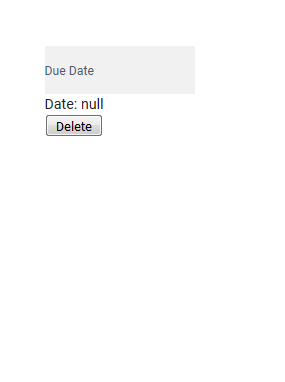
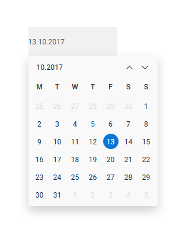
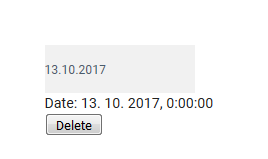
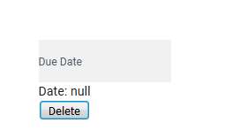

# vuejs-simple-datepicker


Simple and EasyToUse **Datepicker** for every application based on [Vue](https://github.com/vuejs/vue/).
This datepicker supports changing months by mouse scroll.







### How to install
Here is very simple example how to use datepicker:
1. add dependency on `vuejs-simple-datepicker` to your *package.json*
2. run `npm i`
3. in your Vue component *import datepicker* and *register component*:
```javascript
<script>
    import myDatepicker from 'vuejs-simple-datepicker'

    export default {
        components: { 'date-picker': myDatepicker },

        data () {
            return {
                date: null
            }
        },
    }
</script>

```
4. in your template use your datepicker:
```HTML
<date-picker v-model="date" dateFormat="D.M.YYYY" placeholder="Date"></date-picker>
```

### Full Simple Example
```Vue
<template>
    <div style="padding: 50px 0 250px 50px">
        <div style="width: 150px; background-color: #F1F1F1">
            <date-picker v-model="date" :dateFormat="DATE_FORMAT" placeholder="Due Date"></date-picker>
        </div>
        <div>
            Date: {{date ? date.toLocaleString() : 'null'}}
        </div>
        <button v-on:click="remove">Delete</button>
    </div>
</template>

<script>
    import myDatepicker from 'vuejs-simple-datepicker'

    const DATE_FORMAT = 'D.M.YYYY'

    export default {
        components: { 'date-picker': myDatepicker },

        data () {
            return {
                date: null,
                DATE_FORMAT: DATE_FORMAT
            }
        },

        methods: {
            remove () {
                this.date = null
            }
        }
    }
</script>
```